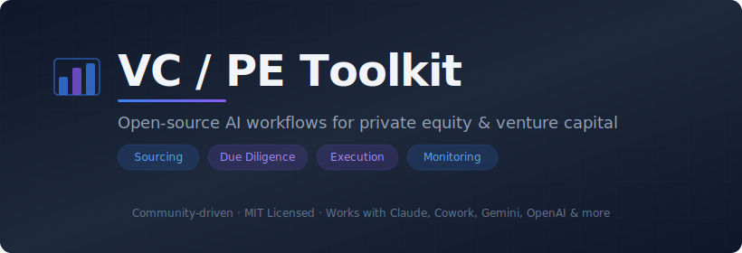
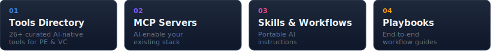

<p align="center">
  
</p>

<p align="center">
  <a href="#whats-in-here"></a>
  <a href="#contributing"></a>
  <a href="https://github.com/LudvigCosma/vc-pe-toolkit/issues/new?template=submit-resource.yml"></a>
  <a href="LICENSE"></a>
  <a href="https://www.linkedin.com/in/ludvig-st%C3%A5lberg-cosma/"></a>
</p>

---

## What's in Here?

A curated collection of tools, MCP servers, skills, and playbooks for PE and VC professionals. Everything you need to AI-enable your investment workflow — from sourcing through portfolio monitoring.

<p align="center">
  
</p>

| Section | What You'll Find |
|---------|-----------------|
| [Tools Directory](#tools-directory) | 26+ curated AI-native tools across 8 categories |
| [MCP Servers](#mcp-servers) | Connect your AI agent to financial data, research, docs & more |
| [Skills & Workflows](#skills--workflows) | Portable skills + 11 Anthropic Cowork plugins for PE/VC tasks |
| [Playbooks](#playbooks) | End-to-end workflow guides (coming soon) |

---

## Stay in the Loop

New resources, demos, and playbooks that actually get used.
Mails sent when ready, not on a schedule.

**[Subscribe on Buttondown](https://buttondown.com/pevctoolkit)**

---

## Tools Directory

Curated tools that PE and VC teams are actually using. Organized by function.

### Deal CRMs

| Tool | Description | Pricing |
|------|-------------|---------|
| [Affinity](https://www.affinity.co) | Relationship intelligence CRM built for dealmakers. Auto-captures contacts and interactions from email and calendar. | Paid |
| [DealCloud](https://www.intapp.com/dealcloud) | End-to-end deal management platform for capital markets. Pipeline tracking, relationship management, and fundraising tools. | Paid |
| [4Degrees](https://www.4degrees.ai) | AI-powered relationship intelligence for deal sourcing. Surfaces warm introductions and tracks relationship strength. | Paid |
| [Altvia](https://www.altvia.com) | CRM and fund management platform built for PE/VC. LP relationship management, fundraising, and portfolio tracking. | Paid |

### Deal Sourcing

| Tool | Description | Pricing |
|------|-------------|---------|
| [PitchBook](https://pitchbook.com) | Comprehensive PE, VC, and M&A database. Company profiles, deal history, fund performance, and market sizing. | Paid |
| [Harmonic](https://www.harmonic.ai) | AI-native company discovery platform. Tracks early-stage companies from founding signals before they hit traditional databases. | Paid |
| [Grata](https://www.grata.com) | AI-powered company search for middle market deal sourcing. Semantic search across millions of private companies. | Paid |
| [Sourcescrub](https://www.sourcescrub.com) | Deal origination platform focused on private company data. Tracks conferences, events, and company signals for outbound sourcing. | Paid |

### Due Diligence

| Tool | Description | Pricing |
|------|-------------|---------|
| [AlphaSense](https://www.alpha-sense.com) | AI-powered market intelligence platform. Search across earnings calls, filings, broker research, and expert transcripts. | Paid |
| [Tegus](https://www.tegus.com) | Expert network and primary research platform. AI-powered search across thousands of expert call transcripts. | Paid |
| [Daloopa](https://www.daloopa.com) | AI-automated financial data extraction. Pulls KPIs and financials directly from filings and reports into models. | Paid |
| [Valutico](https://www.valutico.com) | Automated company valuation platform. DCF, multiples, and transaction comps with real-time market data. | Paid |

### Portfolio Monitoring

| Tool | Description | Pricing |
|------|-------------|---------|
| [Visible](https://visible.vc) | Portfolio monitoring and reporting platform for VC. Automated KPI collection from portfolio companies, LP updates. | Paid |
| [Chronograph](https://www.chronograph.pe) | Portfolio analytics and monitoring for PE/VC. Automated data collection, benchmarking, and LP reporting. | Paid |
| [Cobalt](https://www.cobaltlp.com) | LP portfolio analytics platform. Performance tracking, exposure analysis, and manager benchmarking. | Paid |

### Data Rooms

| Tool | Description | Pricing |
|------|-------------|---------|
| [Datasite](https://www.datasite.com) | Virtual data room for M&A, fundraising, and restructuring. AI-powered document organization and redaction. | Paid |
| [Intralinks](https://www.intralinks.com) | Virtual data room and deal management for M&A. Document sharing, Q&A workflows, and analytics. | Paid |
| [Firmex](https://www.firmex.com) | Virtual data room for due diligence and document sharing. Simple drag-and-drop setup with granular permissions. | Paid |

### LP Reporting

| Tool | Description | Pricing |
|------|-------------|---------|
| [Juniper Square](https://www.junipersquare.com) | Investment management and LP reporting platform. Fund accounting, investor portal, and capital call processing. | Paid |
| [Allvue](https://www.allvuesystems.com) | End-to-end software for fund managers. Portfolio management, fund accounting, and investor reporting. | Paid |
| [Burgiss](https://www.burgiss.com) | Private capital data and analytics. LP portfolio management, benchmarking, and transparency reporting. | Paid |

### Market Intelligence

| Tool | Description | Pricing |
|------|-------------|---------|
| [CB Insights](https://www.cbinsights.com) | Tech market intelligence platform. Company data, industry reports, and predictive analytics for emerging tech. | Paid |
| [Preqin](https://www.preqin.com) | Alternative assets data platform. Fund performance, fundraising, deals, and LP/GP profiles across PE, VC, and more. | Paid |
| [Sacra](https://www.sacra.com) | Private company research and revenue estimates. Independent analysis of high-growth startups with financial models. | Freemium |

### Value Creation

Tools for operating partners and portfolio teams driving value in portfolio companies — from revenue operations and procurement optimization to financial analytics and value creation tracking.

| Tool | Description | Pricing |
|------|-------------|---------|
| [Maestro](https://www.go-maestro.com) | Value creation planning and tracking platform built exclusively for PE. Single workspace to track every initiative from thesis alignment through exit, with KPI frameworks and LP-ready reporting. By Accordion / S&P Global. | Paid |
| [Proven](https://www.getproven.com) | Procurement and vendor management platform for PE/VC portfolios. Connects portfolio companies with vetted providers and negotiates group discounts across the portfolio. Vendor-neutral. | Freemium |
| [ChatFin](https://chatfin.ai) | AI-powered financial analytics for PE portfolio monitoring. Consolidates financials across portfolio companies, automated variance analysis, anomaly detection, and real-time KPI dashboards. | Paid |
| [Glean](https://www.glean.com) | Enterprise AI search that unifies knowledge across docs, CRM, email, and Slack. Increasingly adopted by PE operating teams for cross-portfolio knowledge management and faster DD. | Paid |

---

## MCP Servers

[Model Context Protocol (MCP)](https://modelcontextprotocol.io) servers let your AI agent interact with external tools and data sources directly. Install these to give Claude, Cursor, or any MCP-compatible agent access to financial data, research tools, and more.

### Financial Data

| Server | Description | Source |
|--------|-------------|--------|
| [Octagon](https://github.com/OctagonAI/octagon-mcp-server) | Private market data — company financials, funding rounds, valuations, and investor profiles via natural language queries. | Open Source |
| [SEC EDGAR](https://github.com/keturiosakys/sec-edgar-mcp) | Search and retrieve SEC filings — 10-K, 10-Q, 8-K, and more. Full-text search across EDGAR database. | Open Source |
| [Financial Datasets](https://github.com/financial-datasets/mcp-server) | Stock prices, financial statements, and market data. Access income statements, balance sheets, and cash flow data. | Open Source |
| [Crunchbase](https://github.com/peterparker57/mcp-crunchbase) | Company and funding data from Crunchbase. Search organizations, people, and funding rounds. | Open Source |

### Research & Web

| Server | Description | Source |
|--------|-------------|--------|
| [Firecrawl](https://github.com/mendableai/firecrawl-mcp-server) | Web scraping and crawling. Extract clean content from any URL — useful for company research and competitive analysis. | Open Source |
| [Tavily](https://github.com/tavily-ai/tavily-mcp) | AI-optimized search engine. Returns structured, relevant results — great for market research and company lookups. | Open Source |
| [Exa](https://github.com/exa-labs/exa-mcp-server) | Semantic search across the web. Find companies, research, and content by meaning rather than keywords. | Open Source |

### Documents & Files

| Server | Description | Source |
|--------|-------------|--------|
| [PDF Reader](https://github.com/anaisbetts/mcp-pdf) | Extract text and data from PDFs. Essential for processing CIMs, pitch decks, and financial reports. | Open Source |
| [Google Sheets](https://github.com/nicholasoxford/google-sheets-mcp) | Read and write Google Sheets. Pull portfolio data, update models, and automate reporting workflows. | Open Source |
| [Google Drive](https://github.com/modelcontextprotocol/servers/tree/main/src/gdrive) | Search and read files from Google Drive. Access shared folders, data rooms, and team documents. | Open Source |

### Productivity

| Server | Description | Source |
|--------|-------------|--------|
| [Notion](https://github.com/modelcontextprotocol/servers/tree/main/src/notion) | Read and update Notion pages and databases. Useful for deal pipeline management and meeting notes. | Open Source |
| [Airtable](https://github.com/domdomegg/airtable-mcp-server) | Read and write Airtable bases. Manage deal pipelines, portfolio tracking, and LP databases. | Open Source |
| [Memory](https://github.com/modelcontextprotocol/servers/tree/main/src/memory) | Persistent memory for AI agents. Store deal context, meeting notes, and research across conversations. | Open Source |

---

## Skills & Workflows

Portable instructions that teach an AI agent how to perform a specific task your way. Drop a `SKILL.md` into Claude, Cowork, or any agent that supports custom instructions — it handles the rest.

### Community Skills

> **[Pitch Deck Triage](skills/pitch-deck-triage)** &nbsp; `skill` &nbsp; · &nbsp; *by [LudvigCosma](https://github.com/LudvigCosma)*

*Structured teardown of inbound pitch decks. Extracts financials, team, timing thesis, and deal terms. Flags gaps, surfaces questions, finds comps (including dead ones). IC-ready summary + full analysis.*


### Anthropic Cowork Skills

Skills built by [Anthropic](https://www.anthropic.com) for use with [Cowork](https://www.anthropic.com/cowork) and Claude. Licensed under Apache-2.0.

> **[Contract Review](contract-review-anthropic)** &nbsp; `skill` &nbsp; · &nbsp; *by [Anthropic](https://www.anthropic.com) · Apache-2.0*

*Reviews commercial contracts clause-by-clause. Identifies risk areas, missing protections, and non-standard terms. Produces a structured issue log with severity ratings and suggested redline language.*

> **[NDA Triage](nda-triage-anthropic)** &nbsp; `skill` &nbsp; · &nbsp; *by [Anthropic](https://www.anthropic.com) · Apache-2.0*

*Screens incoming NDAs and classifies them by risk level. Flags non-standard clauses, carve-out gaps, and jurisdiction issues. Outputs a quick assessment with recommended actions.*

> **[Legal Risk Assessment](legal-risk-assessment-anthropic)** &nbsp; `skill` &nbsp; · &nbsp; *by [Anthropic](https://www.anthropic.com) · Apache-2.0*

*Evaluates legal risk across transaction documents. Maps regulatory exposure, identifies liability concentrations, and produces a risk matrix with mitigation recommendations.*

> **[Compliance Check](compliance-anthropic)** &nbsp; `skill` &nbsp; · &nbsp; *by [Anthropic](https://www.anthropic.com) · Apache-2.0*

*Runs compliance screening workflows. Checks regulatory requirements, flags potential issues, and generates compliance reports with action items.*


### Anthropic Cowork Plugins

Installable plugin packages for [Claude Cowork](https://www.anthropic.com/cowork) that bundle skills, commands, and connectors for specific job functions. These go beyond individual skills — each plugin is a complete workflow toolkit.

**Financial Services Plugins** — from [`anthropics/financial-services-plugins`](https://github.com/anthropics/financial-services-plugins)

| Plugin | What It Does | Key Capabilities |
|--------|-------------|-----------------|
| **[Financial Analysis](https://github.com/anthropics/financial-services-plugins)** (core) | Shared foundation for all financial workflows | Comps, DCF models, LBO models, 3-statement models, presentation QC. Connectors: Daloopa, FactSet, S&P Global, PitchBook, Chronograph, Morningstar |
| **[Private Equity](https://github.com/anthropics/financial-services-plugins)** | Deal sourcing and portfolio management | Source/screen deals, DD checklists, unit economics & returns analysis, IC memo drafting, portfolio KPI monitoring |
| **[Investment Banking](https://github.com/anthropics/financial-services-plugins)** | M&A and deal workflow automation | Draft CIMs and teasers, build buyer lists, merger models, strip profiles, deal milestone tracking |
| **[Equity Research](https://github.com/anthropics/financial-services-plugins)** | Research and publishing workflows | Earnings updates, initiating coverage, investment thesis tracking, catalyst monitoring, idea screening |

**Knowledge Work Plugins** — from [`anthropics/knowledge-work-plugins`](https://github.com/anthropics/knowledge-work-plugins)

| Plugin | What It Does | Key Connectors |
|--------|-------------|---------------|
| **[Legal](https://github.com/anthropics/knowledge-work-plugins)** | Contract review, NDA triage, compliance, risk assessment | Box, Egnyte, Jira, Microsoft 365 |
| **[Finance](https://github.com/anthropics/knowledge-work-plugins)** | Journal entries, reconciliation, financial statements, variance analysis, audit prep | Snowflake, Databricks, BigQuery |
| **[Sales](https://github.com/anthropics/knowledge-work-plugins)** | Prospect research, call prep, pipeline review, outreach drafting, competitive battlecards | HubSpot, Close, Clay, ZoomInfo |
| **[Data](https://github.com/anthropics/knowledge-work-plugins)** | SQL writing, dataset exploration, dashboards, statistical analysis | Snowflake, Databricks, BigQuery, Hex, Amplitude |
| **[Product Management](https://github.com/anthropics/knowledge-work-plugins)** | Spec writing, roadmap planning, user research synthesis, stakeholder updates | Linear, Asana, Jira, Figma, Amplitude |
| **[Enterprise Search](https://github.com/anthropics/knowledge-work-plugins)** | Find anything across email, chat, docs, and wikis in one query | Slack, Notion, Guru, Jira, Asana, Microsoft 365 |
| **[Productivity](https://github.com/anthropics/knowledge-work-plugins)** | Task management, calendar workflows, personal context management | Slack, Notion, Asana, Linear, Jira, Microsoft 365 |

<details>
<summary><strong>Install a Cowork plugin</strong></summary>

```bash
# Add the marketplace
claude plugin marketplace add anthropics/financial-services-plugins
claude plugin marketplace add anthropics/knowledge-work-plugins

# Install core (required for financial services plugins)
claude plugin install financial-analysis@financial-services-plugins

# Install add-ons
claude plugin install private-equity@financial-services-plugins
claude plugin install legal@knowledge-work-plugins
```

</details>

---

## Playbooks

> Coming soon — end-to-end workflow guides that combine tools, MCP servers, and skills into complete processes.

Planned playbooks:

- **AI-Powered CIM Teardown** — Use AlphaSense + SEC EDGAR MCP + Claude to break down a CIM in 30 minutes
- **Automated LP Reporting Pipeline** — Connect portfolio monitoring tools via MCP to generate quarterly LP updates
- **Deal Sourcing with AI** — Combine Harmonic, Grata, and semantic search MCPs for outbound deal origination
- **Due Diligence Research Stack** — Set up a complete DD research environment with MCP servers and analysis skills

Want to contribute a playbook? **[Submit one here](https://github.com/LudvigCosma/vc-pe-toolkit/issues/new?template=submit-resource.yml)**

---

## Get Started

### Skills

Each skill folder contains a `SKILL.md` file. To use one:

1. Navigate to the skill you need
2. Copy the contents of `SKILL.md`
3. Add it to your AI agent as a custom skill or system prompt
4. Follow the skill's `README.md` for any setup steps

### MCP Servers

To install an MCP server (example using Claude Desktop):

1. Open Claude Desktop settings → Developer → MCP Servers
2. Add the server configuration from the GitHub repo's README
3. Restart Claude Desktop
4. The server's tools will be available in your conversations

> [!TIP]
> Most MCP servers work with any MCP-compatible client — Claude Desktop, Claude Code, Cursor, Windsurf, and more. Check each server's README for specific setup instructions.

---

## Contributing

We welcome contributions from anyone working in PE, VC, growth equity, or adjacent fields.

### What You Can Submit

| Type | Description | Example |
|------|-------------|---------|
| **Tool Suggestion** | A tool that PE/VC teams should know about | AI-native CRM for deal management |
| **MCP Server** | An MCP server useful for investment workflows | Server for accessing SEC filings |
| **Skill** | A `SKILL.md` that an AI agent can follow | CIM teardown prompt for Claude |
| **Workflow** | A step-by-step playbook using AI tools | Using Gemini to process books during DD |
| **Playbook** | An end-to-end guide combining tools, MCPs, and skills | Complete AI-powered DD research setup |

### Quick Submit (no Git required)

**[Submit here!](https://github.com/LudvigCosma/vc-pe-toolkit/issues/new?template=submit-resource.yml)** — Fill out the form and we'll handle the rest.

### Submit via Pull Request

1. Fork this repository
2. For skills: create a folder under `skills/` with a descriptive name
3. For tools/MCPs: open an issue or PR with the details — no folder needed
4. Open a pull request with a short summary of the use case

### Quality Guidelines

- **Focused** — One resource, one job.
- **Specific** — Be clear about inputs, outputs, and which tools are needed.
- **Tested** — If it works reliably in your workflow, it's ready.
- **Clean** — No proprietary data. Use synthetic or anonymized examples only.

> [!NOTE]
> All submissions are reviewed for quality and security before being added.

See [CONTRIBUTING.md](CONTRIBUTING.md) for the full guide.

---

## Why Open Source This?

Most PE/VC teams are building AI workflows behind closed doors, which makes sense for proprietary strategy — but not for operational tooling. The mechanics of parsing a CIM or formatting an LP report are not competitive advantages. Sharing them makes everyone faster.

---

## Related Resources

- [MCP Server Registry](https://github.com/modelcontextprotocol/servers) — Official directory of MCP servers
- [Anthropic Documentation](https://docs.anthropic.com) — API reference and prompting guides
- [Claude Skills Guide](https://docs.anthropic.com/en/docs/agents-and-tools/claude-code/skills) — How skills work in Claude
- [awesome-legal-skills](https://github.com/lawvable/awesome-legal-skills) — Curated AI skills for legal work

---

## License

[MIT](LICENSE) — use these however you want, commercially or otherwise.

---

<p align="center">
  <sub>Have something that saves your team hours every week? <a href="https://github.com/LudvigCosma/vc-pe-toolkit/issues/new?template=submit-resource.yml">Submit it</a> and share it with the community.</sub>
</p>
